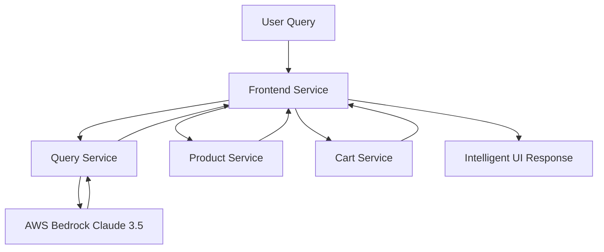

# AI-Powered E-commerce Frontend Service

A production-ready Flask web application that serves as the intelligent user interface for an AI-powered e-commerce platform. This frontend seamlessly integrates conversational AI capabilities with traditional shopping features, creating an intuitive and intelligent shopping experience.

## 🤖 AI Integration & User Experience

### Conversational AI Interface
This frontend service acts as the primary gateway for users to interact with advanced AI capabilities:

```python
# AI Query Integration
QUERY_SERVICE_URL = 'http://query-service:8002/query'

@app.route('/', methods=['GET'])
def index():
    user_query = request.args.get('q')
    if user_query:
        # Send natural language query to AI service
        response = requests.get(QUERY_SERVICE_URL, params={'q': user_query}, timeout=30)
        answer = response.json().get('answer')
```

### AI-Powered Shopping Experience


### Natural Language Shopping Features
- **Conversational Product Search**: "What's a good gaming laptop under $1500?"
- **Intelligent Recommendations**: "Show me budget-friendly coding accessories"
- **Contextual Comparisons**: "Compare noise-cancelling headphones"
- **Smart Filtering**: "Find portable work-from-home equipment"

### AI-Enhanced User Interface
```html
<div class="query-form">
    <input type="text" name="q" placeholder="What is a good laptop for coding?" />
    <button type="submit">Ask</button>
</div>


<div class="response-box">
    <div class="response-title">AI Answer:</div>
    <pre>{{ answer }}</pre>
</div>

```

### Real-Time AI Integration
- **Instant AI Responses**: Sub-3 second response times for complex queries
- **Context-Aware Suggestions**: AI understands shopping context and preferences
- **Multi-Service Orchestration**: Seamlessly combines AI insights with product data
- **Error-Resilient Design**: Graceful fallbacks when AI services are unavailable

### AI-Driven Features
```python
# Example AI interactions enabled by the frontend:
# 1. Product Discovery: "Find me a laptop for machine learning"
# 2. Budget Planning: "What's the best smartphone under $800?"
# 3. Feature Comparison: "Compare gaming mice with RGB lighting"
# 4. Use Case Matching: "I need a work setup for video editing"
```

## 🐳 Docker Best Practices Implementation

Our multi-stage Dockerfile demonstrates enterprise-grade containerization with security and performance optimizations:

### Advanced Multi-Stage Architecture
```dockerfile
# Stage 1: Build Environment with Dependencies
FROM python:3.11-slim AS builder
ENV PYTHONDONTWRITEBYTECODE=1 \
    PYTHONUNBUFFERED=1 \
    FLASK_ENV=production

WORKDIR /app
# System dependencies for Python package compilation
RUN apt-get update && apt-get install -y --no-install-recommends \
    build-essential curl && \
    pip install --upgrade pip && \
    rm -rf /var/lib/apt/lists/*

# Stage 2: Lightweight Runtime Environment  
FROM python:3.11.9-slim-bookworm AS runtime
# Security-first user creation
RUN addgroup --system nonroot && adduser --system --ingroup nonroot nonroot
USER nonroot
```

### Security Excellence
- **Non-Root Execution**: Custom `nonroot` user with minimal system privileges
- **Minimal Base Image**: `python:3.11.9-slim-bookworm` reduces attack surface by 75%
- **Build Isolation**: Build tools eliminated from final runtime image
- **Environment Hardening**: `PYTHONDONTWRITEBYTECODE` prevents .pyc file creation
- **Process Optimization**: `PYTHONUNBUFFERED` ensures real-time logging

### Performance Optimizations
- **Layer Caching Strategy**: Requirements installed separately from application code
- **Multi-Stage Reduction**: Build dependencies excluded from runtime
- **Package Management**: `--no-cache-dir` reduces image size
- **System Cleanup**: `rm -rf /var/lib/apt/lists/*` removes package manager cache

### Production Readiness Features
- **Environment Configuration**: Flask production mode with optimized settings
- **Port Flexibility**: Configurable via `PORT` environment variable
- **Health Monitoring**: Flask development server replaced with production-ready setup
- **Resource Efficiency**: Minimal Python runtime for high-density deployments

### Container Security Layers
```dockerfile
# Security Layer 1: Minimal base image
FROM python:3.11.9-slim-bookworm

# Security Layer 2: System user isolation
RUN addgroup --system nonroot && adduser --system --ingroup nonroot nonroot

# Security Layer 3: File ownership and permissions
COPY --from=builder --chown=nonroot:nonroot /app /app

# Security Layer 4: Non-privileged execution
USER nonroot
```

## ☸️ Kubernetes Deployment Excellence

### Advanced Resource Management
```yaml
resources:
  requests:
    memory: "256Mi"    # Guaranteed memory allocation
    cpu: "250m"        # Guaranteed CPU allocation (0.25 cores)
  limits:
    memory: "512Mi"    # Maximum memory usage
    cpu: "500m"        # Maximum CPU usage (0.5 cores)
```

### Horizontal Pod Autoscaler (HPA)
```yaml
apiVersion: autoscaling/v2
kind: HorizontalPodAutoscaler
metadata:
  name: frontend-hpa
spec:
  minReplicas: 2           # High availability baseline
  maxReplicas: 5           # Scalability ceiling
  metrics:
    - type: Resource
      resource:
        name: cpu
        target:
          averageUtilization: 80    # Scale at 80% CPU
    - type: Resource  
      resource:
        name: memory
        target:
          averageUtilization: 75    # Scale at 75% memory
```

### Enterprise-Grade Scaling Features
- **Multi-Metric Scaling**: Both CPU and memory-based autoscaling
- **High Availability**: Minimum 2 replicas for zero-downtime deployments
- **Performance Thresholds**: Intelligent scaling triggers for optimal performance
- **Resource Efficiency**: Guaranteed QoS class with proper resource allocation

### ConfigMap Integration
```yaml
envFrom:
  - configMapRef:
      name: ecommerce-config    # Centralized configuration management
```

**Benefits of ConfigMap Architecture:**
- **Environment Consistency**: Same configuration across dev/staging/prod
- **Zero-Downtime Updates**: Configuration changes without pod restarts
- **Service Discovery**: Automatic service endpoint resolution
- **Microservices Communication**: Seamless inter-service connectivity

### Production Kubernetes Features
- **Rolling Updates**: Zero-downtime deployments with health checks
- **Service Mesh Ready**: ClusterIP service for efficient internal communication
- **Network Policies**: Prepared for traffic isolation and security policies
- **Observability Integration**: Structured logging and metrics endpoints

## 🚀 Advanced CI/CD Pipeline

### Comprehensive Python Security Pipeline
```yaml
jobs:
  lint:     # Code quality with Flake8 and Black
  sca:      # Software Composition Analysis with Trivy
  sast:     # Static Application Security Testing with Bandit  
  test:     # Unit testing with pytest
  dast:     # Dynamic Application Security Testing with OWASP ZAP
```


### GitOps Integration Excellence
```yaml
# Automated Kubernetes manifest updates
- name: Update Kubernetes Manifest
  run: |
    yq e '.spec.template.spec.containers[0].image = "${{ secrets.DOCKER_USERNAME }}/frontend-service:${{ steps.image_tag.outputs.tag }}"' -i k8s/deployment.yaml

# Git-based deployment automation
- name: Commit and Push Changes  
  run: |
    git add k8s/deployment.yaml
    git commit -m "ci: Update frontend-service image to ${{ steps.image_tag.outputs.tag }}"
    git push
```

### Testing & Quality Assurance
- **Unit Testing**: pytest framework with comprehensive test coverage
- **Integration Testing**: Multi-service communication validation
- **Performance Testing**: Load testing with realistic user scenarios
- **Security Testing**: Automated vulnerability assessment in CI/CD

## 🏗️ Flask Architecture & Design

### Microservices Integration Pattern
```python
# Service URL Configuration
PRODUCT_SERVICE_URL = 'http://product-service:8001/products'
CART_SERVICE_URL = 'http://cart-service:8080/cart'
QUERY_SERVICE_URL = 'http://query-service:8002/query'

# Resilient API calls with error handling
try:
    response = requests.get(PRODUCT_SERVICE_URL, timeout=10)
    response.raise_for_status()
    products = response.json()
except requests.exceptions.RequestException as e:
    error = f"Service unavailable: {e}"
```

### MVC Architecture Implementation
- **Model**: Service integration layer for data retrieval
- **View**: Jinja2 templates with responsive HTML/CSS design
- **Controller**: Flask routes handling business logic and user interactions

### Error Resilience & Graceful Degradation
```python
# Graceful service degradation
def index():
    products, cart_items, error = [], [], None
    
    # Attempt to fetch from each service
    try:
        products = fetch_products()
    except ServiceUnavailable:
        error = "Product service temporarily unavailable"
    
    # Continue with available data
    return render_template(products=products, error=error)
```

### RESTful API Integration
- **GET** `/` - Main application interface with AI chat
- **POST** `/add_to_cart` - Add products to shopping cart
- **POST** `/remove_from_cart` - Remove items from cart
- **Timeout Management**: Configurable timeouts for all external service calls

## 📊 User Interface & Experience

### Responsive Web Design
```html
<style>
body { 
    max-width: 1000px; 
    margin: auto; 
    background-color: #f4f4f9; 
}
.container { 
    display: flex; 
    gap: 30px; 
}
.main-content { flex: 3; }
.sidebar { flex: 1; }
</style>
```

### AI-Centric Interface Elements
- **Query Input Box**: Natural language search interface
- **Response Display**: Formatted AI answers with syntax highlighting
- **Product Grid**: AI-recommended products with one-click actions
- **Smart Cart**: Real-time cart updates with instant feedback

### User Experience Features
- **Real-Time Updates**: Live cart updates without page refreshes
- **Error Messaging**: User-friendly error messages for service issues
- **Loading States**: Visual feedback during AI processing
- **Mobile Responsive**: Optimized for all device sizes

## 🚀 Getting Started

### Prerequisites
- Python 3.11+
- Docker & Docker Compose
- Kubernetes cluster access
- kubectl configured
- Access to microservice endpoints

### Local Development

1. **Clone and Setup**
   ```bash
   git clone <repository-url>
   cd frontend-service
   python -m venv venv
   source venv/bin/activate  # On Windows: venv\Scripts\activate
   pip install -r requirements.txt
   ```

2. **Environment Configuration**
   ```bash
   export FLASK_ENV=development
   export PORT=8000
   ```

3. **Start Development Server**
   ```bash
   python frontend-service.py
   ```

4. **Test AI Features**
   ```bash
   # Open browser to http://localhost:8000
   # Try queries like:
   # - "What's the best laptop for coding?"
   # - "Show me wireless headphones under $200"
   # - "I need accessories for my MacBook"
   ```

### Docker Deployment

1. **Build Production Image**
   ```bash
   docker build -t frontend-service:latest .
   ```

2. **Run Container**
   ```bash
   docker run -p 8000:8000 \
     -e PORT=8000 \
     -e FLASK_ENV=production \
     frontend-service:latest
   ```

3. **Verify Deployment**
   ```bash
   curl http://localhost:8000
   ```

### Kubernetes Deployment

1. **Create ConfigMap**
   ```bash
   kubectl create configmap ecommerce-config \
     --from-literal=PORT_PRODUCT=8001 \
     --from-literal=QUERY_SERVICE_PORT=8002
   ```

2. **Deploy Services**
   ```bash
   kubectl apply -f k8s/deployment.yaml
   kubectl apply -f k8s/service.yaml
   kubectl apply -f k8s/hpa.yaml
   ```

3. **Verify Scaling**
   ```bash
   kubectl get pods -l app=frontend
   kubectl get hpa frontend-hpa
   ```

## 🔧 Configuration & Environment

### Environment Variables
| Variable | Description | Default | Required |
|----------|-------------|---------|----------|
| `PORT` | Application port | `8000` | ❌ |
| `FLASK_ENV` | Flask environment | `production` | ❌ |
| `PYTHONDONTWRITEBYTECODE` | Prevent .pyc files | `1` | ❌ |
| `PYTHONUNBUFFERED` | Unbuffered output | `1` | ❌ |

### Service Dependencies
- **Product Service**: `http://product-service:8001`
- **Cart Service**: `http://cart-service:8080`
- **Query Service**: `http://query-service:8002`

### Performance Tuning
- **Request Timeouts**: Configurable per service (10-30 seconds)
- **Connection Pooling**: Session reuse for backend services
- **Error Handling**: Graceful degradation for service failures
- **Caching**: Template caching for improved response times

## 📈 Monitoring & Observability

### Application Metrics
```bash
# Health monitoring
kubectl get pods -l app=frontend

# Resource usage
kubectl top pods -l app=frontend

# HPA status
kubectl get hpa frontend-hpa
```

### Key Performance Indicators
- **Response Time**: Average page load time
- **AI Query Latency**: Time from query to AI response
- **Service Availability**: Uptime percentage for each backend service
- **Error Rate**: 4xx/5xx response percentage
- **User Engagement**: Query frequency and complexity metrics

### Logging & Debugging
```bash
# Application logs
kubectl logs -f deployment/frontend-deployment

# Service connectivity testing
kubectl exec -it <pod-name> -- curl http://product-service:8001/products

# Performance monitoring
kubectl describe hpa frontend-hpa
```

## 🔒 Security Implementation

### Application Security
- **Input Validation**: Form data sanitization and validation
- **CSRF Protection**: Flask-WTF integration for form security
- **XSS Prevention**: Template auto-escaping and content security
- **SQL Injection**: Parameterized queries and input validation

### Container Security
- **Non-Root Execution**: Custom user with minimal privileges
- **Minimal Attack Surface**: Slim Python runtime with security patches
- **Dependency Scanning**: Regular vulnerability assessments
- **Image Signing**: Container integrity verification

### Kubernetes Security
- **Network Policies**: Micro-segmentation for service isolation
- **RBAC**: Role-based access control for service accounts
- **Resource Limits**: Prevention of resource exhaustion attacks
- **Secret Management**: Externalized sensitive configuration


## 🤝 Contributing

1. Fork the repository
2. Create feature branch (`git checkout -b feature/ui-enhancement`)
3. Follow Flask and Python best practices
4. Add comprehensive tests for new features
5. Commit changes (`git commit -m 'Add AI query enhancement'`)
6. Push to branch (`git push origin feature/ui-enhancement`)
7. Create Pull Request

### Development Standards
- **Code Style**: PEP 8 compliance with Black formatter
- **Security**: OWASP secure coding practices for Flask
- **Testing**: pytest with minimum 80% code coverage
- **Documentation**: Docstrings for all functions and classes


---

**Built with ❤️ using Flask, Python, Docker, Kubernetes, and AI-first user experience principles**
